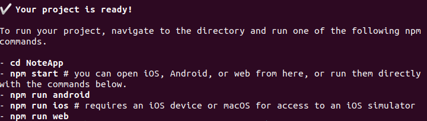

## Workshop sur React Native

Introduction à React Native en réalisant une petite application pour prendre des notes.

---

## Table de matières

- [Technologies requises](#technologies-requises)
- [Installer et débuter avec Expo](#installer-et-débuter-avec-expo)
- [Installer quelques modules supplémentaires](#installer-quelques-modules-supplémentaires)
- [Préparer les dossiers et fichiers](#préparer-les-dossiers-et-fichiers)
- [Commencer le codage](#commencer-le-codage)

---

# Technologies requises

***Voici les technos à avoir pour développer :***

1. [React](https://reactjs.org/) : Une bibliothèque JavaScript pour créer des interfaces utilisateurs.
2. [React Native](https://reactnative.dev/) : Un framework pour créer des applications native en React.
3. [Expo](https://expo.io/) : Une plateforme d’émulation qui permet d’avoir une version directement fonctionnelle d'une application native.

---

# Installer et débuter avec Expo

Tout d'abord entrer cette ligne de commande dans le terminal pour installer Expo cli globalement :

>npm install -g expo-cli

Lancer ensuite la commande expo init suivi du nom du projet :

>expo init NoteApp

Lors de la création de l'application il faudra choisir entre 4 template proposés par expo :


Il faudra choisir "blank" à l'aide des flèches. Il va ensuite automatiquement installer les dépendances nécessaires. Le projet est maintenant prêt.



Pour lancer l'application il faut tout d'abord se déplacer dans le dossier :

>cd NoteApp

Il y a plusieurs façon de faire tourner l'application, les méthodes les plus simples sont sur les points 3 et 4 :

**1. Installer un émulateur Android et/ou IOS :**

  Voir les instructions [ici](https://reactnative.dev/docs/environment-setup) sur "React Native CLI Quickstart" et en choisissant l'OS du pc et l'OS du smartphone. Ensuite lancer avec :
  
  >npm run android

  ou

  >npm run ios

**2. Tester en ligne sur Snack Expo :**

  Aller [ici](https://snack.expo.io/), ajouter tous les dossiers et fichiers nécessaires. Le résultat s'affiche à droite de la page.

**3. Télécharger l'application mobile Expo :**

  Sur [Android](https://play.google.com/store/apps/details?id=host.exp.exponent&gl=BE) ou [IOS](https://apps.apple.com/be/app/expo-client/id982107779?l=fr) télécharger l'application Expo et l'ouvrir. Il faudra alors soit créer un compte Expo et stocker notre application NoteApp dessus ou juste scanner le code QR. Pour trouver le code QR il suffit de lancer sur le terminal :

  >npm run web

  ou

  >npm start

  Le code QR sera alors généré sur le terminal et sur le localhost:19002.

**4. Lancer sur le web :**

  Sur le terminal :

  >npm run web

  Deux pages vont alors s'ouvrir :
  
- Sur le localhost:19002 va s'afficher le log, les appareils connectés, la possibilité de lancer l'app de différentes manières et le code QR.

- Sur le localhost:19006 va s'afficher le résultat de notre app.

---

# Installer quelques modules supplémentaires
  
  L'ajout de ces quelques modules est un choix personnel, c'est pour faciliter la création de components UI et la navigation entre les différentes pages. Entrer la ligne qui suit dans le terminal :

  >npm i react-navigation react-navigation-stack react-native-paper @react-native-community/masked-view

  Maintenant qu'ils sont installés, il faut ajouter les dépendances nécessaires avec expo :

  >expo install react-navigation react-native-gesture-handler react-native-reanimated react-native-screens react-navigation-stack

---

# Préparer les dossiers et fichiers

  A la racine du projet créer un dossier *"src"* dans celui-ci ajouter 3 autres dossiers *"components"*, *"navigation"* et *"screens"*.

  Dans le dossier *"components"* créer un fichier *"Header.js"*. Ce fichier contiendra le code pour afficher le nom des différentes pages en haut de l'écran.

  Dans le dossier *"navigation"* créer un fichier *"index.js"*. Celui-ci aura le code pour nous permettre de naviguer entre les différentes pages.

  Dans le dossier *"screens"* créer un fichier *"AddNote.js"* qui permettra d'ajouter de nouvelles notes, et *"ViewNotes.js"* pour afficher toutes les notes enregistrées.

  

---

# Commencer le codage

  **1. "index.js" :**

  Commencer par créer le moyen de navigation entre les différentes pages :

  ```js
    import { createAppContainer } from 'react-navigation';
    import { createStackNavigator } from 'react-navigation-stack';
    import ViewNotes from '../screens/ViewNotes';
    import AddNote from '../screens/AddNote';

    const StackNavigator = createStackNavigator(
      {
        // Ajouter autant de pages qu'on souhaite
        ViewNotes: {
          screen: ViewNotes
        },
        AddNote: {
          screen: AddNote
        }
      },
      {
        initialRouteName: 'ViewNotes', // La page qui s'ouvre quand l'app est lancé
        headerMode: 'none', // 3 choix : float, screen et none
        mode: 'modal' // 2 choix : card et modal
      }
    )

    export default createAppContainer(StackNavigator);
  ```

  **2. "App.js" :**

  Coder le fichier de base pour le fonctionnement de l'app :

  ```js
    import StatusBar from 'expo-status-bar'; // Étendre le header de l'app vers le haut du smartphone
    import React from 'react';
    import Provider from 'react-native-paper';
    import Navigation from './src/navigation';

    export default function App() {
      return (
        <Provider>
          <Navigation />
          <StatusBar style="auto" />
        </Provider>
      );
    }
  ```

  **3. "Header.js" :**

  Réaliser la méthode pour aller récupérer le titre de chaque page :

  ```js
    import React from 'react'
    import { View, StyleSheet } from 'react-native'
    import { Appbar, Title } from 'react-native-paper'

    function Header({ titleText }) {
      return (
        <Appbar.Header style={styles.headerContainer}>
          <View style={styles.container}>
            <Title style={styles.title}>{titleText}</Title>
          </View>
        </Appbar.Header>
      )
    }

    // Le css ici
    const styles = StyleSheet.create({
      headerContainer: {
        backgroundColor: '#9e42f5'
      },
      container: {
        flex: 1,
        justifyContent: 'center',
        alignItems: 'center'
      },
      title: {
        color: 'white',
        fontWeight: 'bold'
      }
    })

    export default Header;
  ```

  **4. "ViewNotes.js" :**

  En utilisant les states afficher la liste des notes, si aucune note n'est sauvegardée alors dire qu'il n'y en a pas :

  ```js
    import React, { useState } from 'react'
    import { StyleSheet, View, FlatList } from 'react-native'
    import { Text, FAB, List } from 'react-native-paper'
    import Header from '../components/Header'


    export default function ViewNotes({ navigation }) {
      const [notes, setNotes] = useState([]);
      const addNote = note => {
        note.id = notes.length + 1
        setNotes([...notes, note])
      }

      return (
        <>
        <Header titleText='Note Taker' />
        <View style={styles.container}>
          {notes.length === 0 ? (
            <View style={styles.titleContainer}>
              <Text style={styles.title}>You don't have any notes</Text>
            </View>
          ) : (
            <FlatList
              data={notes}
              renderItem={({ item }) => (
                <List.Item
                  title={item.noteTitle}
                  description={item.noteValue}
                  descriptionNumberOfLines={1}
                  titleStyle={styles.listTitle}
                />
              )}
              keyExtractor={item => item.id.toString()}
            />
          )}
          <FAB
            style={styles.fab}
            small
            icon='plus'
            label='Add new note'
            onPress={() =>
              navigation.navigate('AddNote', {
                addNote
              })
            }
          />
        </View>
      </>
      )
    }

    const styles = StyleSheet.create({
      container: {
        flex: 1,
        backgroundColor: '#fff',
        paddingHorizontal: 10,
        paddingVertical: 20
      },
      titleContainer: {
        alignItems: 'center',
        justifyContent: 'center',
        flex: 1
      },
      title: {
        fontSize: 20
      },
      fab: {
        position: 'absolute',
        margin: 20,
        right: 0,
        bottom: 10,
        backgroundColor: '#9e42f5'
      },
      listTitle: {
        fontSize: 20
      }
    })
  ```

  **5. "AddNote.js" :**

  Créer la possibilité d'ajouter de nouvelles notes :

  ```js
    import React, { useState } from 'react'
    import { StyleSheet, View } from 'react-native'
    import { IconButton, TextInput, FAB, Colors } from 'react-native-paper'
    import Header from '../components/Header'

    function AddNote({ navigation }) {
      const [noteTitle, setNoteTitle] = useState('')
      const [noteValue, setNoteValue] = useState('')

      function onSaveNote() {
        navigation.state.params.addNote({ noteTitle, noteValue })
        navigation.goBack()
      }

      return (
        <>
          <Header titleText='Add a new note' />
          <IconButton
            icon='close'
            size={25}
            color={Colors.purple500}
            onPress={() => navigation.goBack()}
          />
          <View style={styles.container}>
            <TextInput
              label='Title Here'
              value={noteTitle}
              onChangeText={setNoteTitle}
              style={styles.title}
            />
            <TextInput
              label='Description Here'
              value={noteValue}
              onChangeText={setNoteValue}
              multiline={true}
              style={styles.text}
              scrollEnabled={true}
              returnKeyType='done'
              blurOnSubmit={true}
            />
            <FAB
              style={styles.fab}
              small
              icon='check'
              disabled={noteTitle == '' ? true : false}
              onPress={() => onSaveNote()}
            />
          </View>
        </>
      )
    }

    const styles = StyleSheet.create({
      container: {
        flex: 1,
        backgroundColor: '#fff',
        paddingHorizontal: 20,
        paddingVertical: 20
      },
      title: {
        fontSize: 24,
        marginBottom: 20
      },
      text: {
        height: 300,
        fontSize: 16
      },
      fab: {
        position: 'absolute',
        margin: 20,
        right: 0,
        bottom: 0
      }
    })

    export default AddNote
  ```

Le codage est maintenant fini et l'app est fonctionnelle, il reste quelques petites améliorations à ajouter comme par exemple : sauvegarder les notes dans une base de données, avoir la posibilité de modifier et/ou supprimer une note etc...

---
